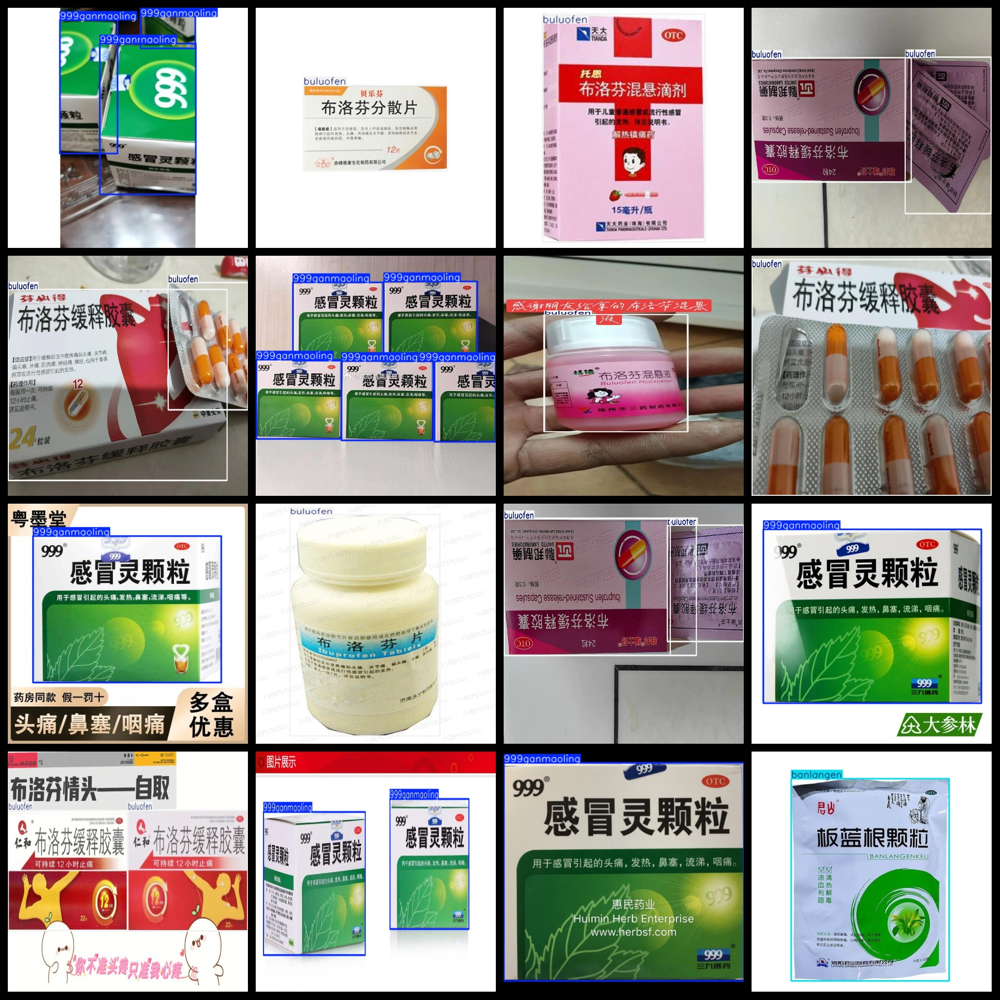

# [Object Detection] Cold medicine Classification Detection Dataset 959 images3-classVOC+YOLO format

Dataset Description: ~

Dataset format: Pascal VOC format + YOLO format (the txt file does not contain the split path, it only contains jpg images and corresponding VOC format xml files and yolo format txt files)

Number of images (number of jpg files): 960

Number of annotations (number of xml files): 960

Number of annotations (number of txt files): 960

Number of annotated categories: 4

Annotation class names: ["999ganmaoling","banlangen","buluofen","drugs"]

Number of boxes labeled in each category:

999ganmaoling frame count = 573

banlangen frame count = 134

buluofen frame count = 657

drugs frame count = 1

Total boxes: 1365

Use the labeling tool: labelImg

Rules for annotation: Draw a rectangle around the category.

Important Note: None

Special Notice: This dataset does not guarantee the accuracy or precision of the trained models or weight files. The dataset only provides accurate and reasonable annotations.

## Images

---

Here is a pay link on Stripe (https://buy.stripe.com/3cs8yP7sY87d0vu9AB). Please contact me lonlonago@foxmail.com after funding $89, and I will send you a complete data files, thank you!

